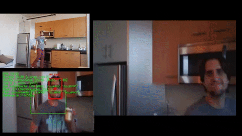

# all_seeing_drone
This is a project to work with the RoboLink CoDrone (https://www.robolink.com/codrone/) to enable the drone to follow someone. It introduces computer vision and movements off of the computer vision to work towards the CoDrone autonomously following someone.

  
Bottom left: processed drone video with debug information  
Top left: cell phone camera in corner of room, showing drone flying  
Right: raw drone input video  
Notice it tracking me!

Here's a youtube video showing off the project. There's a link in the description of this video to another video that is more technical and shows some of the project work.
[Making a PB&J with autonomous drone camera-person](https://www.youtube.com/watch?v=P_NQB7phWnQ&t)

## How do I use this?
Most of this project needs the CoDrone's bluetooth module with drivers plugged into the computer (to command the drone), as well as the computer to be connected to the CoDrone's wifi (to get the video stream).  

To use this, setup a virtual python environment using the requirements.txt file, and then use that environment in a jupyter notebook context using Drone Demo.ipynb, or simply run the run_drone.py script in Python changing arguments for saving video directory. When the video frame pops up the drone will launch shortly, and when you're done flying press "q" on the keyboard with the video frame in focus to land and save videos!

## motivation
Inspired by geaxgx1 Tello Drone Selfie Air Stick (check it out [here](https://www.youtube.com/watch?v=RHRQoaqQIgo))
Geaxgx1 did a cool computer vision project for a drone to follow them and take pictures, I was inspired!  

I wanted to showcase Computer Vision possibilities with CoDrone as well
Plus, I was really interested in Computer Vision and wanted to experiment and learn with an applied project!  

## the goal
To enable CoDrone to follow me and keep me in the center of the video.  
To be able to cook a lunch and have it record the recipe—including my movements from fridge to stove, ect.  

See the youtube link at the start of this README and let me know how I did!

## overview of the repo
this is a monorepo structure, so this all_seeing_drone folder is one sub project in the im_practical_programming. im_practical_programming/all_seeing_drone should be the root if you make a .venv.  

In im_practical_programming/all_seeing_drone/ there are various master scripts. calibrate_drone.py is to be used when drift is obeserved in the drone. camera_test.py is a useful file for a developer to see the video processing and make quick changes without launching the drone.
Drone Demo.ipynb is an older jupyter notebook, but these days I more so use run_drone.py to use the main functionality. The jupyter notebook approach is helpful when you want to connect once and run different commands, as it will stay connected to the drone till you kill the kernel (as opposed to python script which will connect, then disconnect when script ends).  

In im_practical_programming/all_seeing_drone/all_seeing_drone there are the main modules. drone.py is a sublass of the CoDrone library to call computer vision functions and autonomous movement functions. The computer vision functiosn like seeing people and estimating distance from a frame are in drone_camera and the movement functions like PID and PID calibration numbers are in drone_movement.py.

## troubleshooting
*My drone is drifting in the air, why?*  
If you see the drone drifting in air after takeoff, it probably needs to be calibrated. Run the calibrate_drone.py script.

*My drone doesn't launch, why?*  
If you see an error shortly after running the code and the drone doesn't take off, check the battery output in the console. If its low the drone won't launch. Also, ensure you're connected to the drone's wifi and that you have the CoDrone bluetooth module with drivers plugged in.

*The drone crashes, why?*  
It isn't aware of obstacles. All it can do is follow a face at a certain distance, so if doing this would cause it to crash, it will.  

## license info
This is distributed with a GNU General Public License v3.0, permitting almost any use except distributing closed source versions.